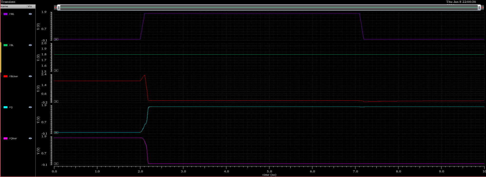
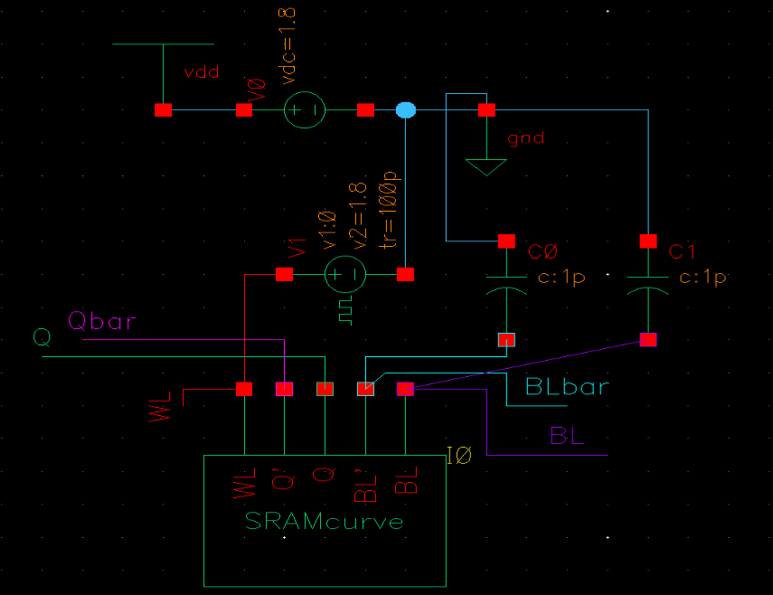

#Design and Performance Analysis of a 6T SRAM Cell and Peripherals in 90nm CMOS Technology

## Project Overview
**Project Report**  
**Technology:** GPDK 90nm CMOS  
**Tools:** Cadence Virtuoso

---

## Table of Contents
1. [Introduction](#introduction)
2. [6T SRAM Cell Design](#6t-sram-cell-design)
3. [Write Operation Analysis](#write-operation-analysis)
4. [Read Operation Analysis](#read-operation-analysis)
5. [Stability Analysis (Butterfly Curve)](#stability-analysis-butterfly-curve)
6. [Peripheral Circuits](#peripheral-circuits)
7. [Top Design: 4x4 Memory Array](#top-design-4x4-memory-array)
8. [Conclusion](#conclusion)

---

## Introduction

Static Random Access Memory (SRAM) is essentially the "muscle memory" of modern computing. It is used wherever speed is the absolute priority, such as in the Cache Memory (L1, L2, L3) of a CPU. The word "Static" means that unlike its cheaper cousin, Dynamic RAM (DRAM), SRAM does not need to be constantly refreshed to keep its data. As long as power is supplied, the data stays locked in.

While DRAM uses a single capacitor to store charge (which acts like a leaky bucket), SRAM uses a team of six transistors to form a latch. This makes it significantly faster and more robust, but also more expensive in terms of silicon area.

### Project Objective
The main goal of this project is to build a complete 16-bit (4x4) SRAM memory array from scratch. We are not just designing the storage cell; we are building the entire support system that makes it work. The project is divided into four key stages:
1.  **The Core:** Design and simulation of the 6T SRAM Cell (The storage unit).
2.  **The Health Check:** Analysis of Read and Write Stability (Butterfly Curves).
3.  **The Support Crew:** Design of Peripheral Circuits (Pre-Charge, Sense Amp, Write Driver).
4.  **Integration:** Connecting everything into a fully functional 4x4 Array.

---

## 6T SRAM Cell Design

The fundamental building block of this memory array is the 6-Transistor (6T) SRAM cell. This is where the single bit of binary information (Logic 0 or Logic 1) actually lives.

### Circuit Explanation
The circuit uses four transistors to form two cross-coupled inverters. Think of these as two people holding hands in a circle—if one lets go, the loop breaks. This loop creates a "Latch" that locks the data in a stable state. The remaining two transistors are the "Access Gates" (or doors) that connect this private loop to the outside world (the Bit Lines) only when we ask them to.

**How it works:**
*   **Hold Mode (Storage):** When the Word Line (WL) is Low (0V), the doors are closed. The internal latch is isolated from the noisy outside world. It sits there reinforcing its own data indefinitely.
*   **Read/Write Mode (Access):** When WL is High (1.8V), the doors open. The Bit Lines (BL and BLbar) can now "talk" to the internal storage nodes (Q and Qbar).

---

## Write Operation Analysis

Writing to an SRAM cell is an act of brute force. The internal latch wants to keep its old value. To change it, we use powerful external "Write Drivers" to overpower the internal transistors and force them to flip.

### Write Logic '1'
To write a '1', we need to force the internal node Q to High and Qbar to Low. We do this by setting the external Bit Line (BL) to a strong 1.8V and the Bit Line Bar (BLbar) to a strong 0V.

**Testbench Setup:**

**Timing Analysis:**

**The Write "1" Sequence:**
*   **The Setup:** Initially, the Word Line (Red trace) is Low. The cell is closed.
*   **The Force:** The Write Driver sets BL to High (Purple) and BLbar to Low (Cyan). They are waiting at the door.
*   **The Breach:** At 2.0ns, the Word Line goes High (Red pulse). The doors open.
*   **The Flip:** Look at the internal nodes Q (Green) and Qbar (Pink). Even though they might have been holding a '0' before, the strong external lines force Q up to 1.8V and Qbar down to 0V.
*   **Success:** The lines cross, and the cell now firmly holds a '1'.

### Write Logic '0'
To write a '0', we simply reverse the attack. We force the Bit Line (BL) to 0V and the Bit Line Bar (BLbar) to 1.8V.

**Testbench Setup:**

**Timing Analysis:**

**The Write "0" Sequence:**
*   The inputs are flipped: BL is Low and BLbar is High.
*   When the Word Line (WL) opens the door, the strong 0V on BL drains the charge out of node Q.
*   Simultaneously, the 1.8V on BLbar rushes into node Qbar.
*   **The Result:** Q (Cyan trace) crashes down to 0V, and Qbar (Pink trace) shoots up to 1.8V.
*   The cell has been successfully overwritten to store a '0'.

---

## Read Operation Analysis

Reading is much more delicate than writing. In writing, we "shouted" at the cell. In reading, we have to "listen" to it. We pre-charge the lines to full voltage, disconnect the power, and then let the tiny SRAM cell gently pull one of the lines down.

### Read Logic '1'
The cell is holding a '1' (Q=1, Qbar=0).

**Testbench Setup:**

**Timing Analysis:**

**The Logic of the Read:**
1.  **Pre-Charge:** Both BL and BLbar start at a full 1.8V (High). Imagine two full buckets of water.
2.  **Access:** When WL (Red) goes High, the cell connects to these buckets.
3.  **The Action:** Since the cell stores a '1', the internal Qbar side is at 0V (Ground).
4.  **The Discharge:** The 0V at Qbar acts like a drain hole. It starts sucking the charge out of the BLbar line.
5.  **The Evidence:** Look at the Cyan trace (BLbar). It starts drooping down. Meanwhile, the Purple trace (BL) stays perfectly full because the Q side is High.
6.  **Conclusion:** This splitting of the lines (one stays high, one drops) is how the system knows a '1' is stored.

### Read Logic '0'
The cell holds a '0' (Q=0, Qbar=1).

**Testbench Setup:**

**Timing Analysis:**

**The Logic of the Read:**
1.  Again, both lines start full (1.8V).
2.  When WL opens the door, the cell connects.
3.  This time, since Q is 0V (Low), it is the Q side that acts as the drain.
4.  **The Evidence:** In the waveform, you can see the Cyan trace (BL) dropping. The Red trace (BLbar) stays High.
5.  Because the *main* Bit Line dropped, the system knows a '0' was stored.

---

## Stability Analysis (Butterfly Curve)

How do we know the cell won't accidentally flip when we try to read it? We measure this using the **Static Noise Margin (SNM)**, visualized as the "Butterfly Curve."

**Testbench Setup:**

**Butterfly Curve Result:**

**Reading the Butterfly:**
This graph plots the strength of the left inverter against the strength of the right inverter.
*   The "Wings" are the voltage transfer curves.
*   The **"Eyes"** (the square openings in the middle) represent the stability.
*   **The Rule:** The larger the square that fits inside these eyes, the more stable the cell is. If the eyes were closed or small, a tiny bit of electrical noise could corrupt our data. Our wide, open eyes indicate a very robust design.

---

## Peripheral Circuits

### Pre-Charge Circuit
The Pre-Charge circuit is the "Cleaning Crew" of the memory system. Before we can read any data, we need the Bit Lines to be in a known state (1.8V). If we left them at random voltages from the last operation, we would get garbage data.

**Schematic:**

**Testbench:**

**Timing Analysis:**

**How it works:**
1.  **The Reset Signal:** In the timing diagram, the Red trace is the Pre-Charge Enable signal.
2.  **The Action:** When this signal drops to 0V, the transistors turn ON. It connects the Bit Lines directly to the power supply.
3.  **The Result:** Look at the Bit Lines (Cyan and Green). They might start at 0V (empty), but the moment the Pre-Charge hits, they shoot up to 1.8V.

### Sense Amplifier
The Sense Amplifier is the "Spy" of the operation. The SRAM cell is weak; it takes a long time to pull a Bit Line all the way to 0V. We don't want to wait that long. The Sense Amp detects a *tiny* voltage difference (like 0.2V) and instantly amplifies it to a full digital "0" or "1".

**Schematic:**

**Testbench:**

**Timing Analysis (Read 1 & Read 0):**

**The Decision Moment:**
1.  **The Race:** Look at the inputs (Red and Green lines). They start falling, but one falls slightly faster. This gap is the "data."
2.  **The Trigger:** The Orange trace is the "Sense Enable" (SE) signal. At this moment, the Sense Amp wakes up.
3.  **The Split:** As soon as SE goes High, the amplifier catches that tiny gap and rips the lines apart.
4.  **The Output:** Look at the Cyan and Purple lines. One shoots to 1.8V, the other crashes to 0V. This proves the amplifier can take a "whisper" of a signal and turn it into a clear digital decision.

### Write Driver
The Write Driver is the "Bully." The SRAM cell tries to hold onto its data with a feedback loop. The Write Driver is designed with huge transistors to simply overpower that loop and force new data in.

**Schematic:**

**Testbench:**

**Timing Analysis:**

**How the Bully works:**
1.  **The Command:** The Top Red trace is the Data Input toggling between 0 and 1.
2.  **The Permission:** The Green trace is "Write Enable" (WE). The driver only acts when this is High.
3.  **The Force:** When WE is High, look at the Bit Lines (Bottom Cyan and Purple). They follow the Data perfectly and snap to 1.8V or 0V instantly.

---

## Top Design: 4x4 Memory Array

This is the Final Boss. We connect the Cells, the Cleaning Crew (Pre-Charge), the Spy (Sense Amp), and the Bully (Write Driver) into a complete 4-row by 4-column memory grid.

**Top Level Schematic:**

### Full System Timing Analysis
We ran a "Full Cycle" simulation: Write a value -> Reset -> Read the value back.

**Write '1' / Read '1' Cycle:**

**The Story of the Simulation (Write 1 / Read 1):**
1.  **Write Cycle (First Half):** The Write Enable signal goes High. The Driver blasts data into the selected cell. You can see the internal node Q (Cyan trace) flipping to the new value.
2.  **Pre-Charge (The Gap):** The system resets. The lines charge up to 1.8V.
3.  **Read Cycle (Second Half):** The Write Driver stays quiet. The Word Line opens. The Sense Amp fires.
4.  **The Victory:** Look at the Sense Amplifier output (Purple/Pink traces). It transitions to the exact same logic level we wrote in step 1.

**Write '0' / Read '0' Cycle:**

**The Story of the Simulation (Write 0 / Read 0):**
1.  **Write Cycle:** The Write Enable goes High with Data set to 0. The internal node Q drops to 0V.
2.  **Read Cycle:** After pre-charging, the Word Line opens. The Sense Amplifier detects the low value stored in the cell.
3.  **Confirmation:** The output stays Low, confirming that the '0' was successfully stored and retrieved.

---

## Conclusion

This project report detailed the design and analysis of a 16-bit SRAM array in 180nm CMOS technology. We successfully designed the 6T cell with proper sizing for stability. We verified that the Pre-Charge circuit cleans the lines, the Sense Amplifier detects weak signals, and the Write Driver successfully overwrites data. Finally, the integration of these blocks into a 4x4 array was simulated, demonstrating correct Write and Read operations with stable timing margins. The design meets the objectives of high-speed and reliable data storage.
